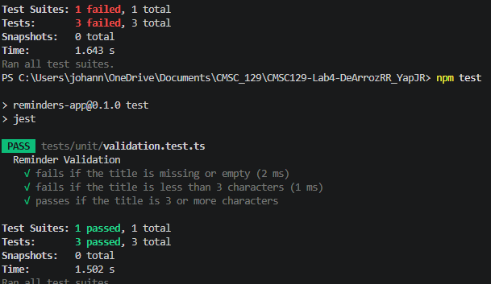
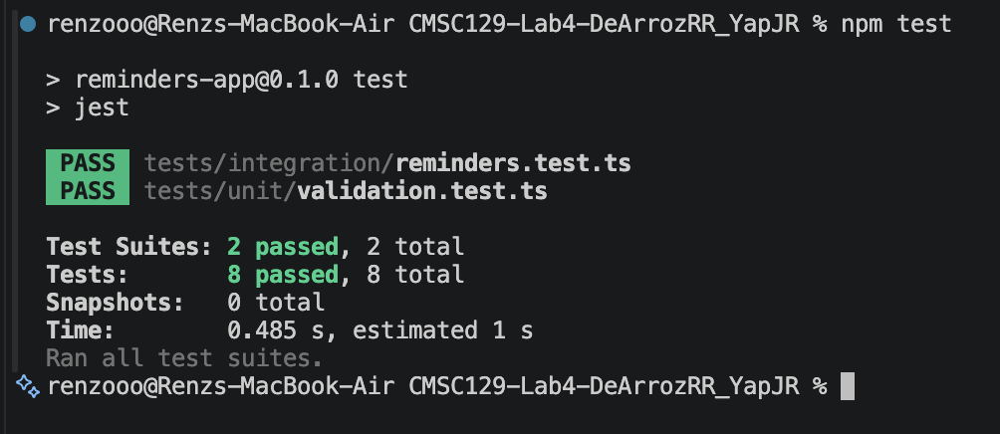
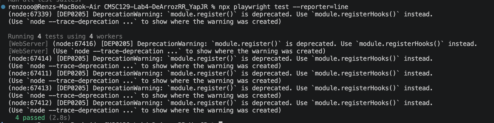

# 🧪 CMSC 129 Laboratory 4 — Reminders App (TDD)

## 📱 App Description

The Reminders App is a simple single-resource CRUD web application inspired by the iOS Reminders application. It allows users to create, view, and manage personal reminders in a clean and minimal interface.

This project is built using Test-Driven Development (TDD), where tests are written before implementation to ensure correctness, maintainability, and disciplined software development using the Red-Green-Refactor cycle.

---

## 👤 User Stories

1. As a user, I want to add a reminder so that I can remember important tasks.

2. As a user, I want to view all my reminders so that I can see what I need to do.

3. As a user, I want to delete or mark reminders as completed so that I can manage finished or unnecessary tasks.

---

## 🧰 Tech Stack

- Frontend: Next.js
- Styling: TailwindCSS
- Unit Testing: Jest + React Testing Library
- Integration Testing: Jest + Supertest
- System Testing: Playwright
- Backend: Express.js (runs alongside Next.js)
- Data Storage: In-memory array

An Express backend runs on port 3001, proxied through Next.js rewrites at `/api/*`.

---

## 🧪 Testing Strategy

This project strictly follows the Test-Driven Development (TDD) Red-Green-Refactor cycle and is divided into three testing levels:

### 🔹 1. Unit Tests
Unit tests focus on isolated business logic and pure functions. These tests do not involve React components or the browser.

Examples:
- Adding a reminder to a list
- Deleting a reminder by ID
- Toggling completion status
- Validating reminder input (e.g., empty title not allowed)

---

### 🔹 2. Integration Tests
Integration tests verify the Express API endpoints using Supertest. These tests ensure that the backend responds correctly to HTTP requests.

Examples:
- GET /api/reminders returns the list of reminders
- POST /api/reminders adds a reminder and returns 201
- POST /api/reminders returns 400 for invalid input
- PATCH /api/reminders toggles completion or updates title
- DELETE /api/reminders removes a reminder by ID

---

### 🔹 3. System Tests
System tests simulate real user behavior in a browser environment. These tests validate the full application flow.

Examples:
- User opens the app and adds a reminder
- User sees the reminder displayed on the screen
- User deletes or completes a reminder and sees UI updates

---

## 🚀 Setup Instructions

```bash
# Install dependencies
npm install

# Run both backend (Express :3001) and frontend (Next.js :3000) together
npm run dev

# Run unit + integration tests
npm test

# Run system tests (Playwright)
npx playwright test

---

## 📊 Test Results
   
### Unit Tests


### Integration Tests


### System Tests


---

## 📝 Reflection

The most difficult part of writing tests before the code was the mental shift required to think about the "what" before the "how." In the beginning, it felt slow because we couldn't just start building the UI or the logic. We had to spend time defining the exact inputs and outputs for every function and component before they even existed. For example, during the unit testing phase, we had to decide on the validation rules for a reminder title before we even knew how the form would look. Another challenge was intentionally pushing code that we knew would fail in the CI pipeline. It felt strange at first, but we realized that this is the best way to prove that the tests are actually effective. It also helped us catch small bugs early, like when our system tests failed because of a simple mismatched button label.

Writing tests first definitely changed the way we designed our code. It made our design much more intentional and modular. Instead of writing one big block of code, we were forced to break things down into smaller, testable units like pure functions for validation and separate API routes for data handling. It also made us prioritize reliability; for instance, we had to rethink our data management and use unique titles in our system tests to prevent data persistence issues between test runs. This led to a more robust application that is easier to maintain. Overall, while TDD felt slower at first, it resulted in a cleaner architecture where every line of code exists for a specific, verified reason. We felt much more confident during the refactor phases because we knew the tests would immediately alert us if we broke anything.